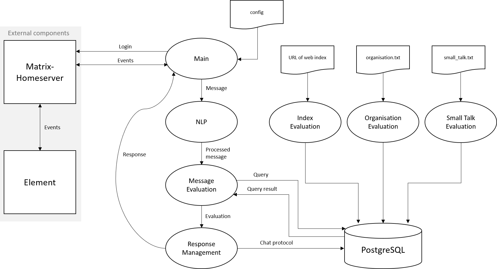
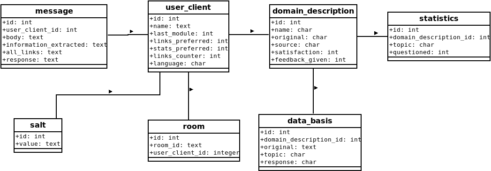
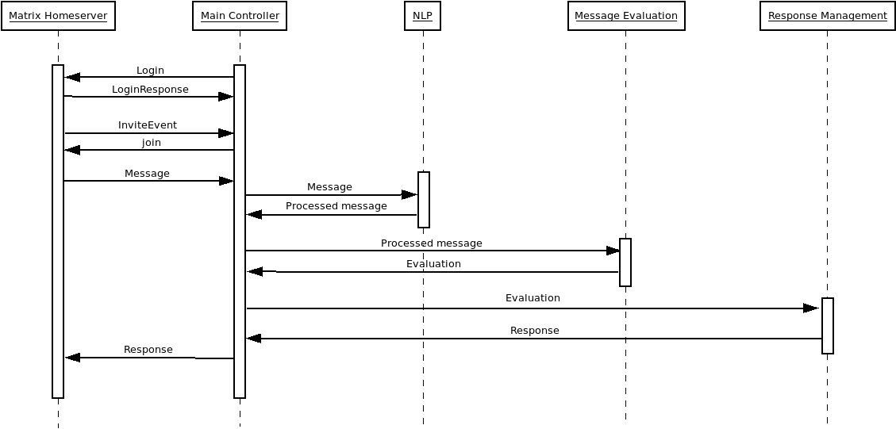

# Matrix-Chatbot

## Table of contents
- [Perequisites](#perequisites)
- [Configuration](#configuration)
- [Setup](#setup)
   - [E2EE support](#e2ee-support)   
- [Architecture](#architecture)
   - [Database schema](#database-schema)
   - [Sequence diagram](#sequence-diagram)
   - [NLP strategy](#nlp-strategy)
- [License](#license)

This natural language processing matrix-chatbot is designed for the messenger [Element](https://github.com/vector-im/element-web) (previously named Riot.im) and is based on the matrix-nio client libary. The chatbot can be used as a digital learning assistant for students and answers lecture related questions with references to slides.
Knowledge extension is achieved by simply adding new rules in predetermined files that serve as a data basis for the chatbot. The application offers a statistical overview of frequently asked topics, which can be queried directly via the chatbot.

## Perequisites
- python version 3.5+
- pip3
- docker.io
- docker-compose

## Configuration
- Create a new Element user account manually.
- Customize the connection parameters of the database and Element account in [config.yaml](https://github.com/jquku/Matrix-Chatbot/blob/master/config.yaml)
- To add chatbot knowledge of a new lecture script, change the URL, if necessary the URL prefix and add the module name all in [index_evaluation.py](https://github.com/jquku/Matrix-Chatbot/blob/master/modules/index_evaluation.py).
- To expand the chatbot's data basis, add new rules to [small_talk_evaluation.py](https://github.com/jquku/Matrix-Chatbot/blob/master/modules/small_talk_evaluation.py) and [organisational_document.py](https://github.com/jquku/Matrix-Chatbot/blob/master/modules/organisational_document.py).
- For organisational documents also add the concerning module name in [organisational_document.py](https://github.com/jquku/Matrix-Chatbot/blob/master/modules/organisational_document.py).

## Setup
1. Clone this repository and navigate into the repoistory folder
2. Install all the requirements
   ```console
   pip3 install -r requirements.txt
3. Add all the nltk data    
   ```console
   python3 -m nltk.downloader all
4. Start the docker container
   ```console
   docker-compose up -d
5. Navgiate into folder models and create all the tables
   ```console
   python3 database.py
6. Add data basis by entering the folder modules and call the following scripts
   ```console
   python3 index_evaluation.py
   python3 organisation_evaluation.py
   python3 small_talk_evaluation.py
7. Start the chatbot
   ```console
   python3 main.py

### E2EE support
The support is still a work in progress for the project. Messages sent to an encrypted room
cannot be handled yet. For future development, this is how matrix-nio with E2EE support can
be downloaded on Ubuntu.

1. Install the latest version of python-olm
   For e2e support, installing the [libolm](https://gitlab.matrix.org/matrix-org/olm) C libary is recommended
   ```console
   git clone https://gitlab.matrix.org/matrix-org/olm.git
   sudo make
   sudo make install
   sudo ldcfongig
2. Install [matrix-nio](https://github.com/poljar/matrix-nio), if you want e2e support call
   ```console
   pip3 install "matrix-nio[e2e]"

## Architecture  
The software architecture is modular and consists of seven modules.


### Database schema
Chabot data is being anonymized and stored in 7 tables in a relational PostgreSQL database. The database
is accessible via docker container.


### Sequence diagram
This sequence diagram describes how an incoming text message is processed by the chatbot to generate
a response fitting the user's message.


### NLP strategy
Test messages are processed with an nlp component. The processing is necessary to standardize the messages
which allows the chatbot to later find fitting entries (rules) from the data basis.


## License
MIT licensed

Copyright (C) 2020 Jonathan Quade
